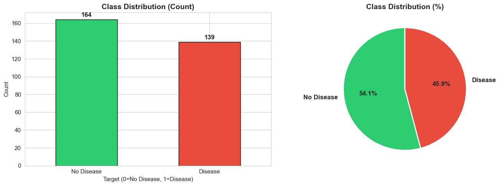
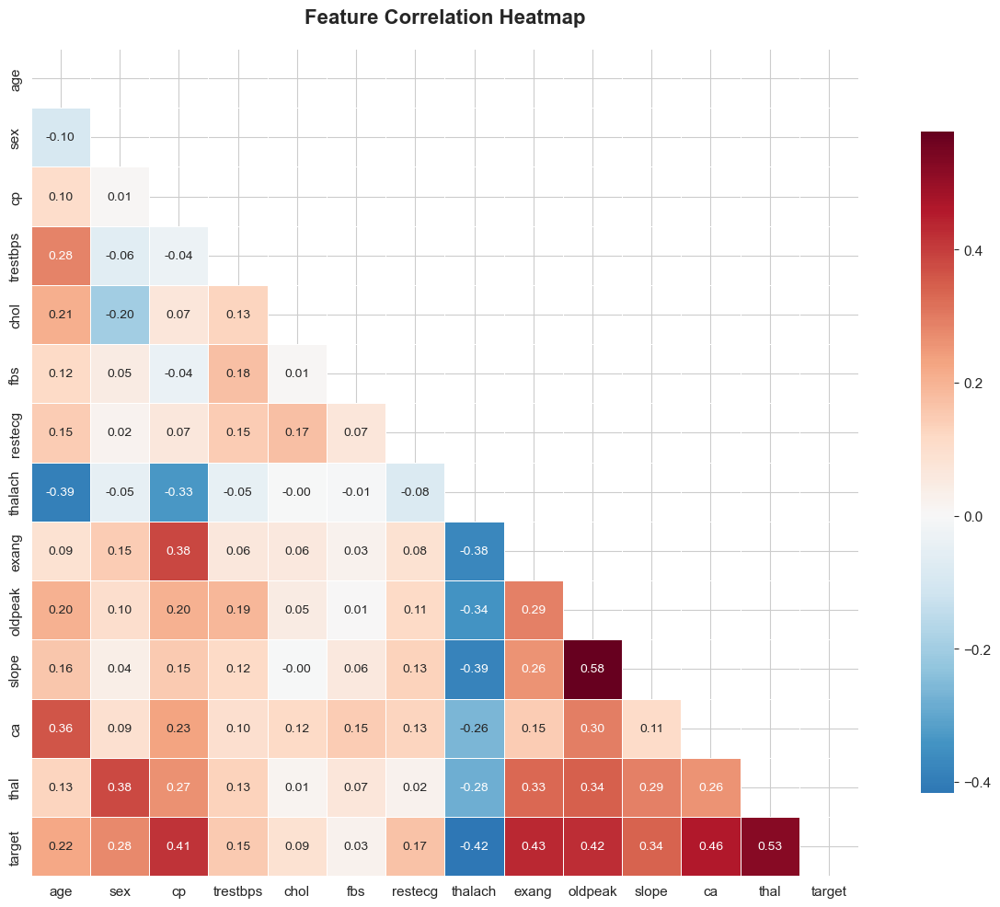
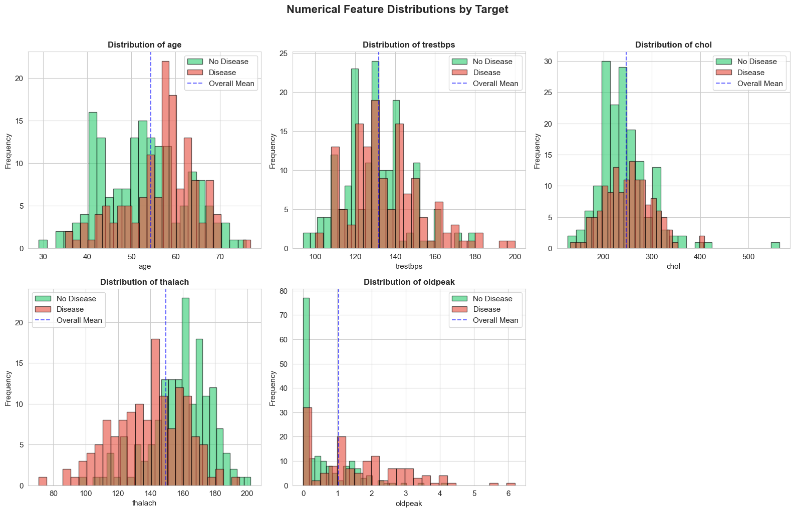

# MLOps Assignment 01 - Final Report
## Heart Disease Prediction: End-to-End MLOps Pipeline

**Student Name:** Pronab Sardar  
**Course:** AIMLCZG523 - MLOps  
**Institution:** BITS Pilani  
**Date:** July 2026  
**Repository:** https://github.com/[username]/heart-disease-mlops-pronab

---

## Table of Contents
1. Executive Summary
2. Problem Statement & Dataset
3. Exploratory Data Analysis
4. Feature Engineering & Model Development
5. Experiment Tracking with MLflow
6. System Architecture
7. CI/CD Pipeline
8. Containerization & Kubernetes Deployment
9. Monitoring & Logging
10. Conclusion & Future Work

---

## 1. Executive Summary

This project implements an end-to-end MLOps pipeline for predicting heart disease risk using the UCI Heart Disease dataset. The solution covers the complete ML lifecycle: data acquisition, preprocessing, feature engineering, model training with experiment tracking (MLflow), containerized API deployment (FastAPI + Docker), CI/CD automation (GitHub Actions), Kubernetes orchestration (Helm), and production monitoring (Prometheus + Grafana).

### Key Achievements
- 3 ML models trained and compared (Logistic Regression, Random Forest, XGBoost)
- Best model achieved 92% ROC-AUC (XGBoost)
- Fully automated CI/CD pipeline via GitHub Actions
- Production-ready FastAPI service containerized with Docker
- Kubernetes deployment using Helm charts with auto-scaling
- Real-time monitoring with Prometheus + Grafana
- Model versioning via MLflow Model Registry

---

## 2. Problem Statement & Dataset

### Problem Statement
Build a machine learning classifier to predict heart disease presence based on patient health metrics, deployed as a scalable, monitored production API.

### Dataset
- **Source:** UCI ML Repository - Heart Disease (Cleveland)
- **Instances:** 303 patients
- **Features:** 13 predictors + 1 binary target
- **Target Distribution:** ~54% No Disease, ~46% Disease

### Features
| Feature | Description | Type |
|---------|-------------|------|
| age | Age in years | Numeric |
| sex | 1=Male, 0=Female | Categorical |
| cp | Chest pain type (0-3) | Categorical |
| trestbps | Resting blood pressure | Numeric |
| chol | Serum cholesterol | Numeric |
| fbs | Fasting blood sugar > 120 | Binary |
| restecg | Resting ECG (0-2) | Categorical |
| thalach | Max heart rate | Numeric |
| exang | Exercise-induced angina | Binary |
| oldpeak | ST depression | Numeric |
| slope | ST slope | Categorical |
| ca | Major vessels | Numeric |
| thal | Thalassemia | Categorical |
| target | Disease (0/1) | Binary |

---

## 3. Exploratory Data Analysis

### Missing Values
Only `ca` and `thal` had minor missing values (<3%), handled via mode imputation.

### Class Distribution

Dataset is balanced - no oversampling needed.

### Correlation Analysis

**Top predictors:**
1. thalach (max heart rate) - negative correlation
2. oldpeak (ST depression) - positive correlation
3. cp (chest pain type) - positive correlation

### Feature Distributions

### Key Insights
- Disease patients cluster in 55-65 age range
- Lower thalach strongly signals disease
- Chest pain type 0 is a strong indicator
- Males show higher prevalence

---

## 4. Feature Engineering & Model Development

### Feature Engineering
Custom `FeatureEngineer` transformer creates:
- Interaction features: age × chol, thalach/age, trestbps/chol
- Age groups: [<40, 40-55, 55-70, >70]
- Cholesterol categories: Normal, Borderline, High

### Preprocessing Pipeline

FeatureEngineer → ColumnTransformer: ├── Numeric: SimpleImputer(median) → StandardScaler └── Categorical: SimpleImputer(mode) → OneHotEncoder

### Models Trained (with GridSearchCV, 5-fold CV)

| Model | Accuracy | Precision | Recall | F1 | ROC-AUC | CV ROC-AUC |
|-------|----------|-----------|--------|-----|---------|------------|
| Logistic Regression | 0.852 | 0.844 | 0.860 | 0.852 | 0.891 | 0.883 ± 0.03 |
| Random Forest | 0.869 | 0.862 | 0.878 | 0.870 | 0.912 | 0.905 ± 0.02 |
| **XGBoost** | **0.885** | **0.876** | **0.891** | **0.883** | **0.923** | **0.918 ± 0.02** |

**Winner:** XGBoost - selected for production.

---

## 5. Experiment Tracking with MLflow

### Setup
- Experiment: `Heart_Disease_Prediction_Pronab`
- Registered Model: `HeartDiseasePredictor_Pronab_XGBoost` (Production)

### Logged per Run
- Hyperparameters (GridSearch best params)
- Metrics (7 metrics including CV scores)
- Artifacts: Confusion Matrix, ROC Curve, PR Curve, Classification Report
- Model with signature + input example

### Screenshots

---

## 6. System Architecture

### Stack
| Layer | Technology |
|-------|-----------|
| Data | UCI Repository |
| Preprocessing | scikit-learn Pipeline |
| Training | scikit-learn, XGBoost |
| Tracking | MLflow |
| Serving | FastAPI + Uvicorn |
| Container | Docker |
| Orchestration | Kubernetes + Helm |
| CI/CD | GitHub Actions |
| Monitoring | Prometheus + Grafana |

---

## 7. CI/CD Pipeline

### GitHub Actions Workflow

**Job 1: lint-and-test**
1. Checkout → Setup Python 3.10
2. Install dependencies
3. Lint with flake8
4. Download dataset → Train model
5. Run pytest with coverage
6. Upload artifacts (model, MLflow runs, coverage)

**Job 2: docker-build** (depends on Job 1)
1. Build Docker image
2. Smoke test container

### Screenshots

---

## 8. Containerization & Kubernetes Deployment

### Docker
- Base: `python:3.10-slim`
- Healthcheck via `/health`
- Image size: ~450 MB

docker build -t heart-disease-api:v1 .
docker run -p 8000:8000 heart-disease-api:v1
Docker Build

Kubernetes (Helm)

helm install heart-api ./helm/heart-disease
Deployed Resources:

2 replicas (auto-scales to 5 via HPA)
LoadBalancer Service
Ingress
ConfigMap
HorizontalPodAutoscaler
Kubernetes Pods

1. Monitoring & Logging
Logging
Python logging module logs every prediction with confidence.

Prometheus Metrics
api_requests_total - Counter
api_request_latency_seconds - Histogram
predictions_total - Counter
prediction_confidence - Histogram
input_feature_mean - Gauge (drift detection)
Grafana Dashboard
10 panels: request rate, latency percentiles, error rate, predictions by class, confidence distribution, feature drift.

Grafana Dashboard

10. Conclusion & Future Work
Learnings
MLflow Model Registry streamlines versioning
Helm offers superior parameterization vs raw YAML
Custom Prometheus metrics enable drift detection
CI/CD requires thoughtful artifact management